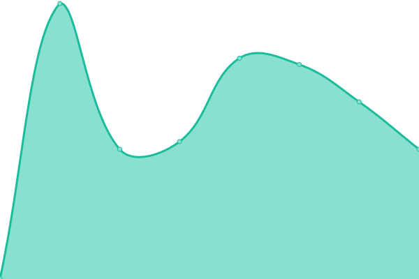
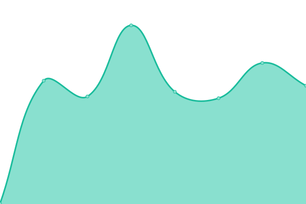

# [📈 Live Status](https://status.ekr.moe): <!--live status--> **🟧 Partial outage**

This repository contains the open-source uptime monitor and status page for [jxstrian](https://www.justlian.com), powered by [Upptime](https://github.com/upptime/upptime).

With [Upptime](https://upptime.js.org), you can get your own unlimited and free uptime monitor and status page, powered entirely by a GitHub repository. We use [Issues](https://github.com/JustLian/uptime/issues) as incident reports, [Actions](https://github.com/JustLian/uptime/actions) as uptime monitors, and [Pages](https://status.ekr.moe) for the status page.

<!--start: status pages-->
<!-- This summary is generated by Upptime (https://github.com/upptime/upptime) -->
<!-- Do not edit this manually, your changes will be overwritten -->
<!-- prettier-ignore -->
| URL | Status | History | Response Time | Uptime |
| --- | ------ | ------- | ------------- | ------ |
|  [www.ekr.moe](https://www.ekr.moe) | 🟩 Up | [www-ekr-moe.yml](https://github.com/JustLian/uptime/commits/HEAD/history/www-ekr-moe.yml) | 

 500ms
     
 | 

<a href="https://status.ekr.moe/history/www-ekr-moe">100.00%</a>
    

|  proto | 🟩 Up | [proto.yml](https://github.com/JustLian/uptime/commits/HEAD/history/proto.yml) | 

 556ms
     
 | 

<a href="https://status.ekr.moe/history/proto">100.00%</a>
    

|  [ekr!mc](mc.ekr.moe) | 🟥 Down | [ekr-mc.yml](https://github.com/JustLian/uptime/commits/HEAD/history/ekr-mc.yml) | 

 0ms
     
 | 

<a href="https://status.ekr.moe/history/ekr-mc">100.00%</a>
    

|  [ekr!kiseki](https://kiseki.ekr.moe/) | 🟩 Up | [ekr-kiseki.yml](https://github.com/JustLian/uptime/commits/HEAD/history/ekr-kiseki.yml) | 

 355ms
     
 | 

<a href="https://status.ekr.moe/history/ekr-kiseki">100.00%</a>
    

|  [ekr!blog](https://blog.ekr.moe/) | 🟩 Up | [ekr-blog.yml](https://github.com/JustLian/uptime/commits/HEAD/history/ekr-blog.yml) | 

 667ms
     
 | 

<a href="https://status.ekr.moe/history/ekr-blog">99.65%</a>
    

|  [node-ichi](ichi.ekr.moe) | 🟩 Up | [node-ichi.yml](https://github.com/JustLian/uptime/commits/HEAD/history/node-ichi.yml) | 

 87ms
     
 | 

<a href="https://status.ekr.moe/history/node-ichi">100.00%</a>
    

|  [node-ni](ni.ekr.moe) | 🟩 Up | [node-ni.yml](https://github.com/JustLian/uptime/commits/HEAD/history/node-ni.yml) | 

 85ms
     
 | 

<a href="https://status.ekr.moe/history/node-ni">100.00%</a>
    

|  [node-san](san.ekr.moe) | 🟩 Up | [node-san.yml](https://github.com/JustLian/uptime/commits/HEAD/history/node-san.yml) | 

 86ms
     
 | 

<a href="https://status.ekr.moe/history/node-san">100.00%</a>
    

<!--end: status pages-->

[**Visit our status website →**](https://status.ekr.moe)

## 📄 License

- Powered by: [Upptime](https://github.com/upptime/upptime)
- Code: [MIT](./LICENSE) © [Anand Chowdhary](https://anandchowdhary.com), supported by [Pabio](https://pabio.com)
- Data in the `./history` directory: [Open Database License](https://opendatacommons.org/licenses/odbl/1-0/)
